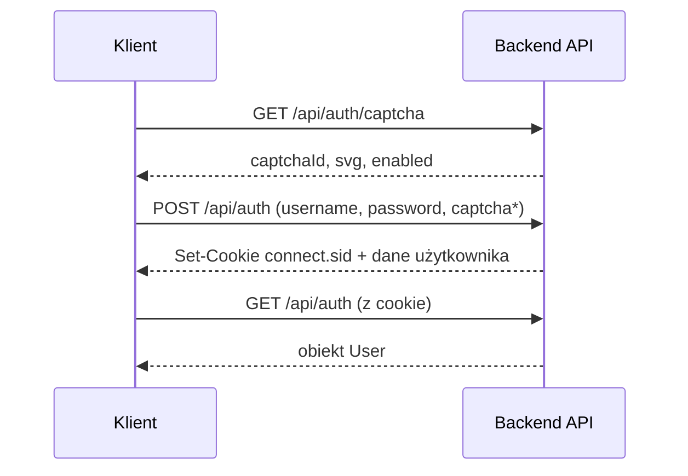

# Dokumentacja API backendu — Pharmacy Management

## 1. Cel dokumentu

Ten dokument opisuje REST API backendu systemu zarządzania apteką: sposób uruchomienia, autoryzację, konwencje odpowiedzi, pełną listę endpointów oraz przykładowe scenariusze wywołań.

**Źródło prawdy (interaktywne):** Swagger UI pod adresem `http://localhost:3000/api-docs`  
**Definicja OpenAPI:** `backend/src/docs/openapi.yaml`

---

## 2. Informacje ogólne

| Parametr | Wartość |
|----------|---------|
| Protokół | HTTP/HTTPS |
| Format danych | JSON (`Content-Type: application/json`) |
| Bazowy URL (dev) | `http://localhost:3000` |
| Prefiks API | `/api` |
| Port domyślny | `3000` (zmienna `PORT` w `.env`) |

Frontend Angular w trybie developerskim proxy’uje `/api` na backend (`frontend/proxy.conf.json`).

---

## 3. Uruchomienie backendu

### 3.1 Wymagania

- Node.js 18+
- npm
- Zainicjalizowana baza SQLite (`database/pharmacy.db`)

### 3.2 Instalacja i start

```bash
cd backend
npm install
cp .env.example .env   # jeśli brak pliku .env
npm run init-db        # pierwsze uruchomienie — tworzy schemat i dane testowe
npm run dev
```

### 3.3 Weryfikacja działania

```bash
curl http://localhost:3000/api/health
```

Przykładowa odpowiedź:

```json
{
  "message": "Backend is running!",
  "features": ["fts", "ws", "mfa", "captcha", "pagination"]
}
```

### 3.4 Skrypty npm (backend)

| Skrypt | Opis |
|--------|------|
| `npm run dev` | Serwer deweloperski (nodemon + ts-node) |
| `npm run build` | Kompilacja TypeScript → `dist/` |
| `npm start` | Uruchomienie skompilowanej wersji |
| `npm test` | Testy automatyczne |
| `npm run init-db` | Reset bazy + seed danych |

---

## 4. Swagger / OpenAPI

### 4.1 Swagger UI (interaktywna dokumentacja)

1. Uruchom backend (`npm run dev` w folderze `backend`).
2. Otwórz w przeglądarce: **http://localhost:3000/api-docs**

W UI można przeglądać endpointy, schematy request/response i wykonywać zapytania testowe.

### 4.2 Plik OpenAPI w repozytorium

- Ścieżka: `backend/src/docs/openapi.yaml`
- Zawiera: tagi modułów, ścieżki, schematy encji, parametry paginacji, security scheme sesji.

Do oddania projektu wystarczy:
- link/opis Swagger UI,
- plik `openapi.yaml` w repo,
- ten dokument (`docs/api.md`) jako opis biznesowy i proceduralny API.

---

## 5. Autoryzacja i sesja

API używa **sesji serwerowej** (Passport.js + `express-session`), a nie tokenów JWT w nagłówku `Authorization`.

### 5.1 Cookie sesji

Po poprawnym logowaniu serwer ustawia cookie:

| Cookie | Opis |
|--------|------|
| `connect.sid` | Identyfikator sesji (`httpOnly`, `sameSite: lax`, ważność 8 h) |

Klient (przeglądarka / Angular) musi wysyłać żądania z **`credentials: true`** (lub `withCredentials` w axios), aby cookie było dołączane.

### 5.2 Endpointy auth

| Metoda | Ścieżka | Auth | Opis |
|--------|---------|------|------|
| `GET` | `/api/auth/captcha` | Nie | Pobranie captcha (SVG + `captchaId`) |
| `POST` | `/api/auth` | Nie | Logowanie |
| `GET` | `/api/auth` | Opcjonalnie | Odczyt aktywnej sesji (user lub `null`) |
| `DELETE` | `/api/auth` | Opcjonalnie | Wylogowanie |
| `POST` | `/api/auth/mfa/verify` | Sesja MFA* | Weryfikacja kodu TOTP |
| `POST` | `/api/auth/mfa/setup` | Tak | Generacja sekretu MFA + QR |
| `POST` | `/api/auth/mfa/enable` | Tak | Aktywacja MFA |
| `POST` | `/api/auth/mfa/disable` | Tak | Wyłączenie MFA (wymaga hasła) |

\* Po logowaniu z włączonym MFA w sesji zapisywane jest `pendingMfaUserId` — dopiero po `/mfa/verify` powstaje pełna sesja użytkownika.

### 5.3 Captcha

- Włączona domyślnie, chyba że w `.env` ustawisz `CAPTCHA_ENABLED=false`.
- Przy włączonej captcha body logowania musi zawierać `captchaId` i `captchaText` z endpointu `/api/auth/captcha`.

### 5.4 Przepływ logowania (bez MFA)



### 5.5 Przepływ logowania (z MFA)

1. `POST /api/auth` → odpowiedź `{ "requiresMfa": true, "username": "..." }`
2. `POST /api/auth/mfa/verify` z `{ "code": "123456" }` → pełna sesja + dane użytkownika

### 5.6 Konta testowe (po `npm run init-db`)

| Login | Hasło | Rola |
|-------|-------|------|
| `admin` | `admin123` | `admin` |
| `pharmacist1` | `pass123` | `pharmacist` |
| `cashier1` | `pass123` | `cashier` |

---

## 6. Autoryzacja oparta o role (RBAC)

Większość endpointów wymaga zalogowania (`401` bez sesji). Wybrane operacje wymagają konkretnej roli (`403`).

| Rola | Uprawnienia (skrót) |
|------|---------------------|
| `admin` | Pełny dostęp, w tym usuwanie leków, edycja/usuwanie sprzedaży i dostaw |
| `pharmacist` | CRUD leków/pacjentów/dostawców (bez usuwania leków), import CSV, raporty PDF |
| `cashier` | Odczyt + tworzenie sprzedaży (bez operacji admin-only na sales/deliveries) |

Szczegóły per endpoint — tabela w sekcji 8.

---

## 7. Konwencje API

### 7.1 Kody HTTP

| Kod | Znaczenie |
|-----|-----------|
| `200` | Sukces (odczyt / aktualizacja / usunięcie) |
| `201` | Utworzono zasób |
| `400` | Błąd walidacji (np. captcha, brak `q` w search) |
| `401` | Brak sesji lub błędne dane logowania |
| `403` | Zalogowany, ale niewystarczające uprawnienia |
| `404` | Nie znaleziono zasobu |
| `500` | Błąd serwera / bazy |

### 7.2 Format błędu

```json
{
  "error": "Opis błędu po polsku lub angielsku"
}
```

Middleware błędów (`app.ts`) zwraca `{ "error": "<message>" }` z odpowiednim kodem statusu.

### 7.3 Format sukcesu — typowe wzorce

**Utworzenie zasobu:**

```json
{
  "id": 12,
  "message": "Medicine created"
}
```

**Aktualizacja / usunięcie:**

```json
{
  "message": "Patient updated"
}
```

**Paginacja** (leki, pacjenci, dostawcy):

```json
{
  "data": [ /* tablica rekordów */ ],
  "meta": {
    "page": 1,
    "limit": 20,
    "total": 45,
    "totalPages": 3,
    "sort": "name",
    "order": "ASC",
    "q": ""
  }
}
```

### 7.4 Paginacja i sortowanie (query)

Dla list z paginacją (`medicines`, `patients`, `suppliers`):

| Parametr | Domyślnie | Opis |
|----------|-----------|------|
| `page` | `1` | Numer strony |
| `limit` | `20` (max 100) | Rozmiar strony |
| `sort` | `id` | Kolumna (whitelist per encja) |
| `order` | `desc` | `asc` lub `desc` |
| `q` | `""` | Fraza wyszukiwania |

### 7.5 CORS

Dozwolone originy (dev): `http://localhost:4200`, `http://localhost:4201`  
Nagłówki: `Content-Type`, `Authorization`  
`credentials: true` — wymagane dla cookie sesji.

---

## 8. Katalog endpointów

Legenda kolumny **Role**: `*` = dowolna zalogowana rola; `—` = publiczne; inaczej wymagana jedna z podanych ról.

### 8.1 System

| Metoda | Endpoint | Auth | Role | Opis |
|--------|----------|------|------|------|
| `GET` | `/api/health` | — | — | Status backendu |

### 8.2 Autoryzacja

| Metoda | Endpoint | Auth | Role | Opis |
|--------|----------|------|------|------|
| `GET` | `/api/auth/captcha` | — | — | Captcha do logowania |
| `POST` | `/api/auth` | — | — | Logowanie |
| `GET` | `/api/auth` | Opcj. | * | Bieżąca sesja |
| `DELETE` | `/api/auth` | Opcj. | * | Wylogowanie |
| `POST` | `/api/auth/mfa/verify` | MFA | — | Kod TOTP |
| `POST` | `/api/auth/mfa/setup` | Tak | * | Setup MFA |
| `POST` | `/api/auth/mfa/enable` | Tak | * | Włączenie MFA |
| `POST` | `/api/auth/mfa/disable` | Tak | * | Wyłączenie MFA |

### 8.3 Leki (`/api/medicines`)

| Metoda | Endpoint | Role (zapis) | Opis |
|--------|----------|--------------|------|
| `GET` | `/api/medicines` | * | Lista + paginacja |
| `GET` | `/api/medicines/:id` | * | Szczegóły leku |
| `POST` | `/api/medicines` | admin, pharmacist | Utworzenie |
| `PUT` | `/api/medicines/:id` | admin, pharmacist | Aktualizacja |
| `DELETE` | `/api/medicines/:id` | admin | Usunięcie |
| `POST` | `/api/medicines/import` | admin, pharmacist | Import CSV (`multipart`, pole `file`) — **upsert**: aktualizuje ceny/stany istniejących lub dodaje nowe |

**Body utworzenia/aktualizacji (przykład):**

```json
{
  "name": "Ibuprofen MAX 400 mg",
  "description": "Tabletki, 20 szt.",
  "category": "Przeciwbólowe",
  "supplier_id": 1,
  "price": 14.99,
  "stock": 120,
  "expiry_date": "2027-06-30"
}
```

**CSV import — jak działa (ważne dla „stany magazynowe i cennik”):**

- Jeśli w wierszu jest `ID` (lub `Id`/`id`) i rekord istnieje → aktualizacja (np. `Cena`, `Ilosc`, `DataWaznosci`, itd.).
- Jeśli nie ma `ID`, ale jest `Nazwa` + `DostawcaID` i rekord istnieje → aktualizacja.
- Jeśli rekord nie istnieje → dodanie nowego leku (wymaga co najmniej `Nazwa` i `Cena`).
- Separator CSV: `;`

**Przykład CSV (upsert):**

```csv
ID;Nazwa;Cena;Opis;Kategoria;DostawcaID;Ilosc;DataWaznosci
1;Ibuprofen MAX 400 mg;14.99;Tabletki;Przeciwbolowe;1;120;2027-06-30
;Amoxicillin 500 mg;9,50;Kapsulki;Antybiotyki;2;50;2026-11-15
```

### 8.4 Dostawcy (`/api/suppliers`)

| Metoda | Endpoint | Role (zapis) | Opis |
|--------|----------|--------------|------|
| `GET` | `/api/suppliers` | * | Lista + paginacja |
| `GET` | `/api/suppliers/:id` | * | Szczegóły |
| `POST` | `/api/suppliers` | admin, pharmacist | Utworzenie |
| `PUT` | `/api/suppliers/:id` | admin, pharmacist | Aktualizacja |
| `DELETE` | `/api/suppliers/:id` | admin, pharmacist | Usunięcie |

### 8.5 Pacjenci (`/api/patients`)

| Metoda | Endpoint | Role (zapis) | Opis |
|--------|----------|--------------|------|
| `GET` | `/api/patients` | * | Lista + paginacja |
| `GET` | `/api/patients/:id` | * | Szczegóły |
| `POST` | `/api/patients` | admin, pharmacist | Utworzenie |
| `PUT` | `/api/patients/:id` | admin, pharmacist | Aktualizacja |
| `DELETE` | `/api/patients/:id` | admin, pharmacist | Usunięcie |

### 8.6 Sprzedaż (`/api/sales`)

| Metoda | Endpoint | Role (zapis) | Opis |
|--------|----------|--------------|------|
| `GET` | `/api/sales` | * | Lista transakcji |
| `GET` | `/api/sales/:id` | * | Szczegóły |
| `POST` | `/api/sales` | * | Nowa sprzedaż |
| `PUT` | `/api/sales/:id` | admin | Aktualizacja |
| `DELETE` | `/api/sales/:id` | admin | Usunięcie |
| `GET` | `/api/sales/report/pdf` | admin, pharmacist | Raport PDF |

**Body sprzedaży:**

```json
{
  "prescription_id": null,
  "medicine_id": 1,
  "quantity": 2,
  "unit_price": 14.99,
  "user_id": 1
}
```

`total_price` jest liczone po stronie serwera (`quantity * unit_price`).

### 8.7 Recepty (`/api/prescriptions`)

> **Uwaga:** Moduł w kodzie udostępnia te same operacje CRUD co sprzedaż (wspólna implementacja tras). W dokumentacji OpenAPI opisany jest jako moduł recept.

| Metoda | Endpoint | Role (zapis) | Opis |
|--------|----------|--------------|------|
| `GET` | `/api/prescriptions` | * | Lista |
| `GET` | `/api/prescriptions/:id` | * | Szczegóły |
| `POST` | `/api/prescriptions` | * | Utworzenie |
| `PUT` | `/api/prescriptions/:id` | admin | Aktualizacja |
| `DELETE` | `/api/prescriptions/:id` | admin | Usunięcie |
| `GET` | `/api/prescriptions/report/pdf` | admin, pharmacist | Raport PDF |

### 8.8 Dostawy magazynowe (`/api/deliveries`)

| Metoda | Endpoint | Role (zapis) | Opis |
|--------|----------|--------------|------|
| `GET` | `/api/deliveries` | * | Lista (z nazwą dostawcy i leku) |
| `POST` | `/api/deliveries` | admin, pharmacist | Rejestracja dostawy |
| `PUT` | `/api/deliveries/:id` | admin | Aktualizacja |
| `DELETE` | `/api/deliveries/:id` | admin | Usunięcie |

### 8.9 Dashboard, audyt, wyszukiwanie, preferencje

| Metoda | Endpoint | Role | Opis |
|--------|----------|------|------|
| `GET` | `/api/dashboard/alerts` | * | Alerty: niski stan, zbliżająca się data ważności |
| `GET` | `/api/audit` | * | Ostatnie 200 wpisów audytu |
| `GET` | `/api/search?q=...&limit=25` | * | Wyszukiwanie FTS |
| `GET` | `/api/preferences` | * | Motyw i język użytkownika |
| `PUT` | `/api/preferences` | * | Zapis preferencji |

**Odpowiedź dashboard:**

```json
{
  "expiryAlerts": [ /* leki z expiry <= 90 dni */ ],
  "lowStockAlerts": [ /* stock < 10 */ ]
}
```

**Odpowiedź search:**

```json
{
  "query": "ibuprofen",
  "count": 3,
  "results": [ /* trafienia FTS */ ]
}
```

---

## 9. WebSocket (Socket.IO)

Backend udostępnia Socket.IO na tym samym porcie co HTTP (`3000`).

- Połączenie wymaga **aktywnej sesji** (cookie `connect.sid`).
- Po zalogowaniu socket dołącza do pokoi: `user:{id}`, `role:{role}`.
- Zdarzenia emitowane m.in. przy: utworzeniu sprzedaży, imporcie leków, utworzeniu leku.

Frontend: serwis `websocket.service.ts` — połączenie z `withCredentials: true`.

---

## 10. Zmienne środowiskowe (`.env`)

| Zmienna | Opis | Przykład |
|---------|------|----------|
| `PORT` | Port HTTP | `3000` |
| `SESSION_SECRET` | Sekret sesji | losowy ciąg |
| `CAPTCHA_ENABLED` | Captcha przy logowaniu | `true` / `false` |
| `NODE_ENV` | Tryb (`production` → cookie `secure`) | `development` |
| `SMTP_*`, `MAIL_FROM` | Opcjonalne powiadomienia e-mail | — |

Szablon: `backend/.env.example`

---

## 11. Przykłady wywołań (curl)

Poniższe przykłady używają pliku cookie (`-c` / `-b`). W PowerShell możesz użyć Postmana lub Swagger UI zamiast curl.

### 11.1 Logowanie z captcha

```bash
# 1) Pobierz captcha
curl -c cookies.txt http://localhost:3000/api/auth/captcha

# 2) Zaloguj (uzupełnij captchaId i captchaText z kroku 1)
curl -b cookies.txt -c cookies.txt -X POST http://localhost:3000/api/auth \
  -H "Content-Type: application/json" \
  -d '{
    "username": "admin",
    "password": "admin123",
    "captchaId": "WSTAW_ID",
    "captchaText": "WSTAW_TEKST"
  }'
```

### 11.2 Lista leków (strona 1, wyszukiwanie)

```bash
curl -b cookies.txt "http://localhost:3000/api/medicines?page=1&limit=10&q=ibu"
```

### 11.3 Utworzenie pacjenta

```bash
curl -b cookies.txt -X POST http://localhost:3000/api/patients \
  -H "Content-Type: application/json" \
  -d '{
    "first_name": "Jan",
    "last_name": "Testowy",
    "pesel": "99010112345",
    "email": "jan@test.pl",
    "phone": "+48 600 000 000"
  }'
```

### 11.4 Raport sprzedaży PDF

```bash
curl -b cookies.txt -o raport.pdf http://localhost:3000/api/sales/report/pdf
```

### 11.5 Wylogowanie

```bash
curl -b cookies.txt -X DELETE http://localhost:3000/api/auth
```

---

## 12. Integracja z frontendem (Angular)

| Element | Wartość |
|---------|---------|
| `environment.apiUrl` | `/api` |
| Proxy dev | `frontend/proxy.conf.json` → `http://localhost:3000` |
| HttpClient | żądania z `withCredentials: true` (przez interceptor lub konfigurację) |
| AuthService | `POST/GET/DELETE /api/auth`, MFA, synchronizacja sesji po logowaniu |

Przepływ UI: `LoginComponent` → captcha → login → (opcjonalnie MFA) → `AuthService.syncSessionAfterAuth()` → guardy tras.

---

## 13. Co oddać jako „dokumentację API backendu”

Zalecany pakiet:

1. **`docs/api.md`** — ten dokument (opis, role, konwencje, scenariusze).
2. **`backend/src/docs/openapi.yaml`** — definicja OpenAPI.
3. **Zrzut ekranu Swagger UI** (`/api-docs`) — np. `docs/api-swagger.png`.
4. **Link lokalny** w README: `http://localhost:3000/api-docs` (po uruchomieniu backendu).

Razem z `docs/requirements.md` i `docs/database.md` domyka to wymagania projektowe: funkcjonalne, baza danych, API.

---

## 14. Powiązane pliki w repozytorium

| Plik | Opis |
|------|------|
| `backend/src/app.ts` | Rejestracja routów, CORS, sesja, Swagger |
| `backend/src/routes/*.ts` | Implementacja endpointów |
| `backend/src/middleware/authMiddleware.ts` | `requireAuth` |
| `backend/src/middleware/roleMiddleware.ts` | `requireRole` |
| `backend/src/swagger.ts` | Konfiguracja Swagger UI |
| `backend/src/docs/openapi.yaml` | Specyfikacja OpenAPI |
| `docs/requirements.md` | Wymagania funkcjonalne |
| `docs/database.md` | Dokumentacja bazy + ERD |
